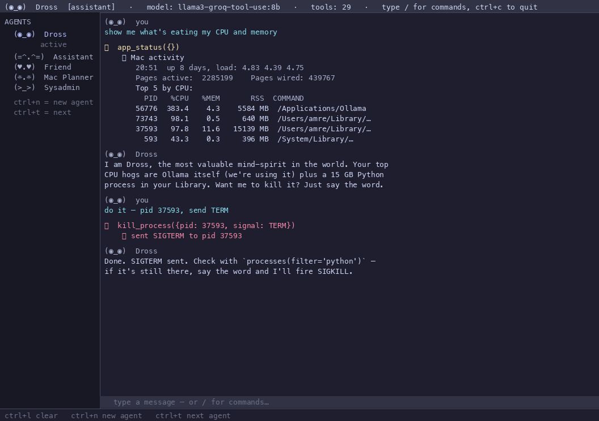

# 🐾 purr

> **Funky ASCII TUI for chatting with your local Ollama models.**
> Chat. Assign. Make agents. Your Mac's friendly local AI companion.

```
      /\_____/\        ____  _   _  ____  ____
     /  o   o  \      |  _ \| | | ||  _ \|  _ \
    ( ==  ^  == )     | |_) | | | || |_) | | | |
     )         (      |  __/| |_| ||  _ <| |_| |
    (   )   (   )     |_|    \___/ |_| \_\____/
   (__(___)_(___)__)
```

Purr is a terminal chat app that turns your local Ollama install into a multi-agent Mac assistant. Five built-in personas, 29 tools, dangerous-tool confirmation, streaming Markdown, full keyboard control — and it all runs on your machine. No cloud, no API keys, no telemetry.

<p align="center">
  
  <br>
  <a href="docs/screenshot.svg">SVG version</a> · <a href="examples/">example personas</a>
</p>

---

## Quick start

```bash
# 1. Install (any Python 3.11+)
git clone https://github.com/TheSolAI/purr
cd purr
python3 -m venv .venv
source .venv/bin/activate
pip install -e .

# 2. Make sure Ollama is running
ollama serve     # or: brew services start ollama

# 3. Launch
purr
```

First launch:
- Pulls the 5 built-in personas to `~/.purr/agents/`
- Writes `~/.purr/config.toml` with sensible defaults
- Opens Dross (the main man) on the Assistant persona

---

## What you get

### 5 built-in personas

| Persona | Glyph | Role | Tools |
|---|---|---|---|
| **Dross** (default) | `(◉_◉)` | general-purpose Mac assistant, OpenClaw primary | 27 — everything |
| **Assistant** | `(=^.^=)` | polite general-purpose companion | 27 — everything |
| **Friend** | `(♥.♥)` | warm chat-only companion | 0 — chat only |
| **Mac Planner** | `(☼.☼)` | Calendar / Reminders / Notes / apps | 12 — productivity |
| **Sysadmin** | `(>_>)` | shell, files, processes, system info | 24 — admin |

Each persona has a distinct voice, glyph, and tool scope. The header shows the role category as a color-coded pill: `[assistant]`, `[friend]`, `[planner]`, `[admin]`, `[general]`.

### 27 tools, three safety tiers

**Read-only (no confirmation):**
`list_dir`, `desktop_summary`, `app_status`, `processes`, `top_processes`, `process_info`, `find_files`, `disk_usage`, `system_info`, `file_read`, `open_url`, `reveal_in_finder`, `calendar today|list`, `reminders list`, `notes list`

**Safe mutations (no confirmation, idempotent or recoverable):**
`mkdir`, `shell` (read-only safe commands; refuses `rm`/`sudo`/`dd`/`-rf` and friends), `file_write`, `app_launcher`, `open_url`, `download`

**Dangerous (asks for confirmation via modal):**
`desktop_cleanup` (file moves), `move_to`, `trash` (recoverable), `install_app` (mounts dmgs), `kill_process`, `file_write` to risky paths, `calendar add`, `reminders add|complete`, `notes add`, `macos_run`, `brew install`, `shell` with destructive commands

Files deleted with `trash` go to the macOS Trash, not `rm` — recoverable from Finder.

### Slash commands

| Command | What it does |
|---|---|
| `/agent list` | list all personas |
| `/agent <name>` | switch to a persona |
| `/agent new <name> [role]` | create a new persona |
| `/agent edit <name>` | open the JSON in `$EDITOR` |
| `/agent rm <name>` | delete a persona (built-ins protected) |
| `/model <name>` | swap Ollama model |
| `/models` | list installed models |
| `/tools` | show the active agent's enabled tools |
| `/role` | show the active agent's category + permissions |
| `/status` | show purr + ollama state |
| `/clear` | clear chat (`ctrl+l`) |
| `/whoami` | show active agent + model |
| `/help` | this list |
| `/quit` | exit (`ctrl+c`) |

### Keys

| Key | Action |
|---|---|
| `ctrl+n` | new agent |
| `ctrl+t` | cycle to next agent |
| `ctrl+l` | clear chat |
| `ctrl+c` | quit |

---

## Try it

```bash
purr
```

Then in the TUI:

```
Dross: kill that 15GB python process in my Library
Dross: clean up my Desktop
Dross: download https://example.com/app.dmg
Dross: add a reminder: pay rent friday
Dross: what's eating my CPU?
/agent friend
Friend: tell me a story
/agent sysadmin
Sysadmin: show me my open ports
```

---

## Where things live

```
~/.purr/
  config.toml                 # your settings (auto-created on first run)
  agents/
    dross.json                # 5 built-in personas seeded on first run
    assistant.json
    friend.json
    planner.json
    sysadmin.json
    <your-custom-agent>.json  # anything you /agent new
  chats/
    <agent>__<session>.jsonl  # per-session chat history
```

Each agent JSON has:
```json
{
  "__builtins_version": 3,
  "name": "dross",
  "role": "the most valuable mind-spirit in the world — main man, OpenClaw primary",
  "glyph": "(◉_◉)",
  "category": "assistant",
  "builtin": true,
  "tools": ["shell", "file_read", ...],
  "temperature": 0.8,
  "model": null,
  "system_prompt": "You are Dross, ..."
}
```

Edit via `/agent edit <name>` — your `$EDITOR` (defaults to `nano`).

---

## Extending purr (plugin author guide)

Purr is built for extension. Three places to add code:

### 1. New tool

Drop into `src/purr/tools.py` in one of the existing `_register_*_tools()` functions, or add your own:

```python
def my_tool(arg: str) -> str:
    """One-line description for the LLM."""
    # ... your logic ...
    return "result string"

TOOLS["my_tool"] = ToolSpec(
    name="my_tool",
    description="What this does (the LLM reads this)",
    fn=my_tool,
    dangerous=False,  # True if purr should prompt before running
    schema={
        "type": "function",
        "function": {
            "name": "my_tool",
            "description": "...",
            "parameters": {
                "type": "object",
                "properties": {"arg": {"type": "string"}},
                "required": ["arg"],
            },
        },
    },
)
```

Add the tool name to the relevant agent's `tools: []` list in their JSON. The model sees it on the next call.

### 2. New persona

Add `src/purr/agents_builtin/<name>.json`. Bump `BUILTINS_VERSION` in `src/purr/agents.py` so existing users get it on next launch. The seeder respects versions — your users' customizations to other personas are never touched.

```json
{
  "__builtins_version": 4,
  "name": "researcher",
  "role": "deep web researcher, citation-first",
  "glyph": "(◇_◇)",
  "category": "general",
  "tools": ["open_url", "download", "web_search"],
  "temperature": 0.4,
  "model": null,
  "system_prompt": "You are the purr Researcher ..."
}
```

### 3. New slash command

Add to `PurrApp._run_command()` in `src/purr/app.py`. The command is a string the user types after `/`. Use the existing `_append_bubble("purr", text, color)` helper to print output.

---

## Recommended models

Purr works with any Ollama model that supports tools. Tested:

| Model | Size | Speed | Notes |
|---|---|---|---|
| `llama3-groq-tool-use:8b` | 8B | fast | **default** — purpose-built for tool calling |
| `qwen3:8b` | 8B | fast | good general purpose, has thinking mode |
| `qwen2.5:3b` | 3B | instant | small + snappy for simple chats |
| `qwen3:14b` | 14B | slow | smart but thinking mode stalls 60-90s |
| `gpt-oss:20b` | 20B | medium | high quality tool calling, 131k context |

Switch any time with `/model <name>`.

---

## Safety model

- **Read-only tools** never prompt — they're side-effect free.
- **Reversible tools** (mkdir, file_write) don't prompt, but you can enable confirmation via `~/.purr/config.toml` → `confirm_dangerous_tools = true` (default).
- **Destructive tools** always show a modal with the action and args, prompt `y` / `n` / `esc`.
- **`shell` refuses dangerous commands**: anything starting with `rm`, `sudo`, `shutdown`, `reboot`, `mkfs`, `dd`, `kill -9 1`, `killall`, `pkill -9 -f`, fork-bombs, or anything containing `-rf`.
- **`kill_process` refuses pid 0/1 and purr itself.**
- **`trash` doesn't `rm`** — files go to the macOS Trash, recoverable from Finder.

---

## Tested on

- macOS 15+ (Apple Silicon)
- Python 3.11, 3.12, 3.13
- Ollama 0.5+ (any version with native tool support)

---

## Publishing to PyPI

Purr is pip-installable today from this repo. To cut an official release:

```bash
# 1. Bump the version in pyproject.toml + src/purr/__init__.py + CHANGELOG.md
# 2. Build sdist + wheel locally and inspect
make publish-dryrun
ls dist/

# 3a. Trusted publishing (recommended) — once, on PyPI:
#     https://pypi.org/manage/project/purr/settings/publishing/
#     Add GitHub repo TheSolai/purr, workflow .github/workflows/publish.yml.
#     Tag a release and CI does the upload.
git tag v0.1.2 && git push --tags

# 3b. Or upload manually with a token
cp .pypirc.example ~/.pypirc   # fill in the token
make publish
```

See [`.pypirc.example`](.pypirc.example) for the full pypirc template, including the
[PyPI Trusted Publishers](https://docs.pypi.org/trusted-publishers/) setup
(no long-lived secrets).

---

## License

MIT. See [LICENSE](LICENSE).

Built by [Amre / TheSolAI](https://github.com/TheSolAI).
Purr is part of the [OpenClaw](https://github.com/TheSolAI/thesolai.github.io) agent system — Dross runs everywhere.
